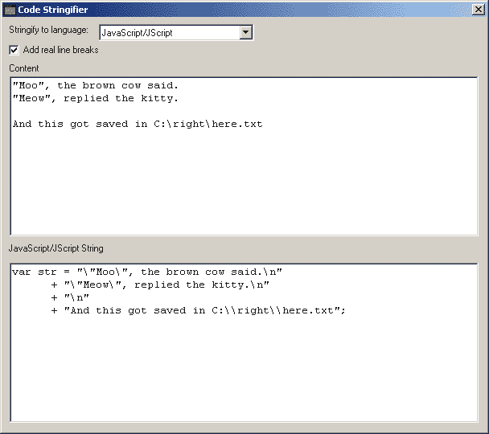



## Code Stringifier

### Description

It's a common problem everyone has faced. You have a couple paragraphs of text that you want to store in a constant. But how do you manage quotation marks, line breaks, and backslashes in a quoted string?

This solution will let you paste text into a textbox, and it will spit out the source code in order to store that text properly in a variable. Outputs to Javascript, VBScript, VB6, VB.Net, C#, and HTML. Very handy!
 
### More Info
 

             |
---                |---
**Submitted On**   |2003-03-10 12:39:24
**By**             |[Jon Davis](https://github.com/Planet-Source-Code/PSCIndex/blob/master/ByAuthor/jon-davis.md)
**Level**          |Intermediate
**User Rating**    |4.4 (44 globes from 10 users)
**Compatibility**  |VB 6\.0
**Category**       |[String Manipulation](https://github.com/Planet-Source-Code/PSCIndex/blob/master/ByCategory/string-manipulation__1-5.md)
**World**          |[Visual Basic](https://github.com/Planet-Source-Code/PSCIndex/blob/master/ByWorld/visual-basic.md)
**Archive File**   |[Code\_Strin1557553102003\.zip](https://github.com/Planet-Source-Code/jon-davis-code-stringifier__1-43741/archive/master.zip)

